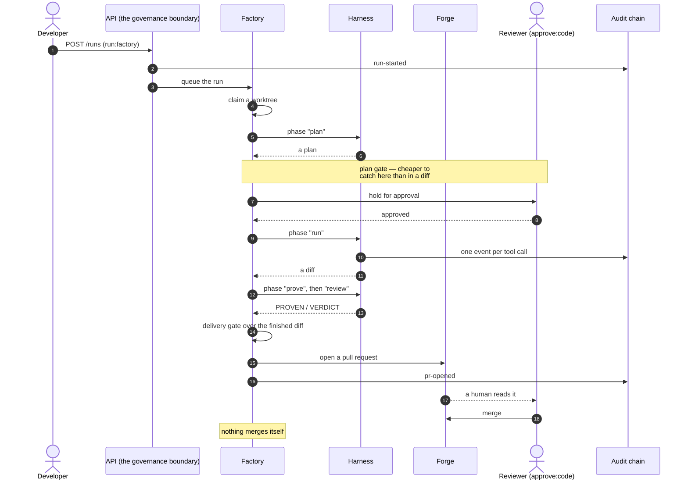
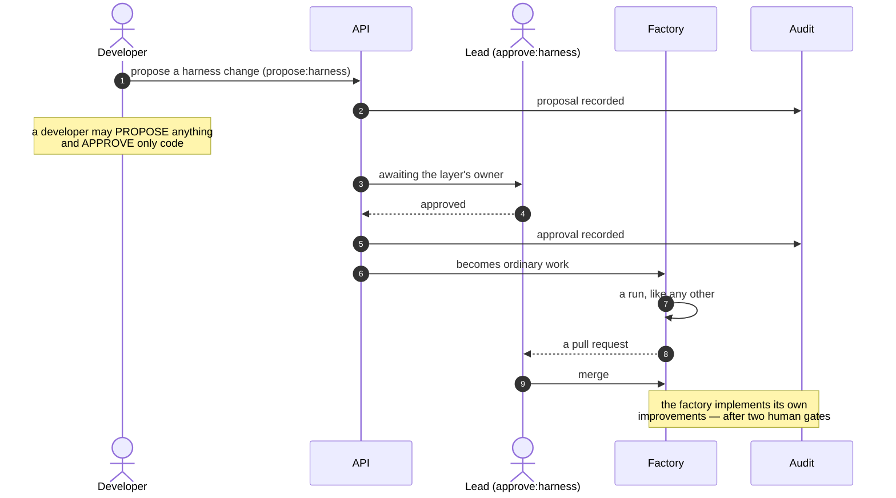
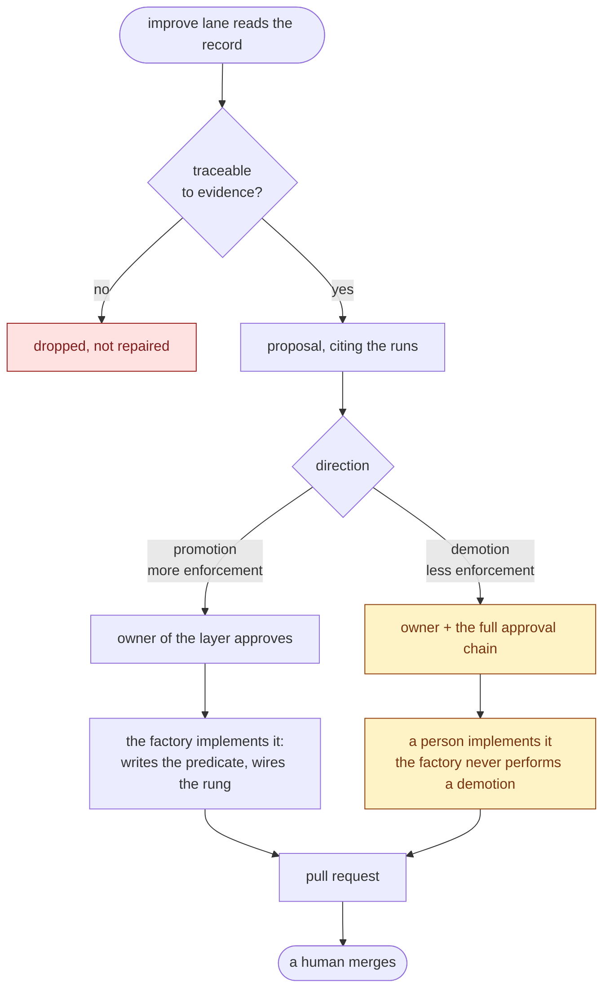
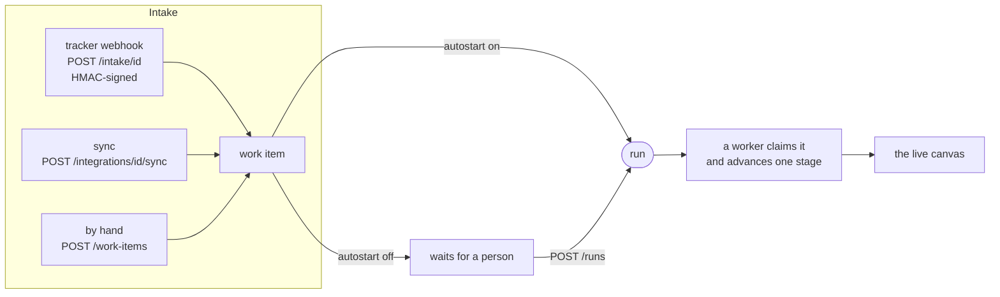
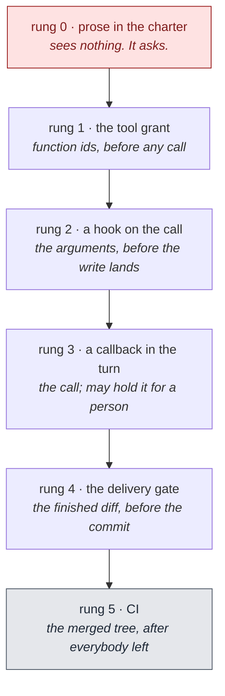
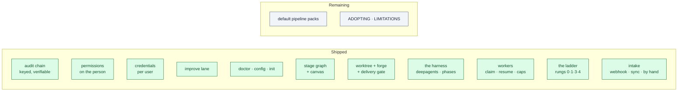

# open-refinery — features, permissions, and the journey of a change

*Generated against 3.0.0-dev. The companion to [PLAN-3.0.md](PLAN-3.0.md): that
one says where we are going, this one says what exists and who can reach it.*

Two things to hold on to before the diagrams:

- **Authorization is a set of permissions on a person.** Roles are *presets* —
  starting points copied onto a user at creation, never read again. Where a
  preset name appears below it is shorthand for "whoever holds that set".
- **A layer is what a change is *about***: `code` · `harness` · `factory` ·
  `charter`. Almost every gate in the system keys off one.

---

## 1. Who can do what


**Read the gaps, not the arrows.** Three of them carry the whole design:

| Gap | Why |
|---|---|
| **admin approves nothing** | The account that grants access is not the account that approves what ships. A compromised admin can create users and read the log; it cannot merge a change or weaken a rule. |
| **lead ≠ platform** | The product is both a harness and a factory, so each gets an owner. A lead changing a prompt does not need platform; platform changing a route does not need a lead. |
| **nobody above developer approves code** | A lead reviewing a teammate's pull request holds no special authority over it. That review is a developer's job. |

`propose:*` is deliberately wide and `approve:*` is deliberately narrow. That
asymmetry is what the improve lane runs on: anyone may put a change forward,
and only the layer's owner signs it.

---

## 2. Every feature, by the permission it needs

142 routes. Grouped by what you must hold to reach them.

`propose:*` below is shorthand for all four: `propose:code`,
`propose:harness`, `propose:factory`, `propose:charter`.

### Open to any signed-in person

| Feature | Routes |
|---|---|
| Who am I, what do I hold | `GET /me` · `GET /users/{id}/permissions` (your own) |
| Read the vocabulary | `GET /permissions` · `GET /permissions/approvers/{layer}` · `GET /roles` |
| Read the shared workflow | `GET /processes` |
| Your own connections | `GET|POST|PUT|DELETE /credentials` · `GET /credentials/catalog` |
| Your own repos and work | `GET /repositories` · `GET /work-items` · `GET /metrics` |
| Approvals you are party to | `GET /approvals` · `POST /approvals/{request_id}/approve` |
| Put a change forward | `POST /proposals` · `GET /proposals` · `POST /proposals/{proposal_id}/review` |

A credential is personal: you see and manage your own, and a secret is never
returned to anyone at any permission.

### `run:factory` — doing the work

| Feature | Routes |
|---|---|
| Create work | `POST /work-items` |
| Pull tickets in from a tracker | `POST /integrations/{id}/sync` |
| Let a tracker push them in | `PUT /integrations/{id}/intake` (sets the webhook + autostart) |
| Move work along | `POST /work-items/{id}/transition` |
| Trigger a run | `POST /runs` |
| Watch runs move | `GET /runs` · the live canvas over `/ws` |
| Clear a hold | `POST /runs/{id}/approve` |

### `approve:factory` — the factory is platform's

| Feature | Routes |
|---|---|
| The stage graph | `POST /processes` |

### `approve:charter` — the standards are the lead's

| Feature | Routes |
|---|---|
| Org rules | `POST|DELETE /policies` |
| Standards packs | `POST /packs/{key}/enable` · `POST /packs/{key}/disable` |

### `see:operations` — other people's work, and the machinery

| Feature | Routes |
|---|---|
| Everyone's repos, work and runs | the same GETs, unscoped |
| Config | `GET|PUT|DELETE /settings` |
| Delivery plumbing | `/webhooks` · `/notification-rules` · `/teams` |
| Finish setup | `POST /onboarding/complete` |

### `manage:users` — admin

| Feature | Routes |
|---|---|
| Add people, set permissions | `POST /users` · `PUT /users/{id}/permissions` |
| Define presets | `PUT|DELETE /presets/{name}` |
| Who approves governance changes | `POST /approval-workflows` |

### `read:audit` — admin and the time-boxed auditor grant

| Feature | Routes |
|---|---|
| The trail | `GET /events` |
| Prove it was not altered | `GET /audit/verify` · `GET /audit/export` · `/audit/export.csv` |
| Retention | `POST /audit/purge` |
| Compliance packs | `GET /evidence` · `GET /evidence/frameworks` |
| The improve lane | `GET /improve` · `GET /improve/proposals` |
| Lend read-only access out | `/auditor-grants` |

---

## 3. The journey of a change

### 3.1 A code change — the common case



The reviewer needs **`approve:code`** — not lead, not platform. And the run
uses **the runner's own credentials**, so the pull request is authored by the
person accountable for it.

### 3.2 A harness change — and why it is different



A `factory` change is the same picture with **platform** in the lead's place. A
`charter` change is the same with **lead** again, because the standards are
what the harness reads.

### 3.3 A ladder move — promotion and demotion are not symmetric



Two rules do the work. **Evidence or it is dropped** — a lane that always finds
three things is one nobody believes by the third time. And **a demotion is the
one move that makes the system weaker**, so it never runs unattended and the
factory never carries it out itself.

---

## 4. Workflows

### 4.1 Getting started — install to first run


`doctor` is the thread through all of it: nine checks, each carrying a remedy
rather than only a diagnosis. Signing up seeds `ship-a-ticket`, so there is a
workflow to run before anybody has drawn one.

Work reaches the factory three ways, and behaves the same however it arrived:



The webhook is the one route with no bearer token — the caller is a tracker,
not a person — so the signature is the credential, and an integration with no
secret accepts nothing.

### 4.2 The default pipeline — `ship-a-ticket`


Three things in that picture are the whole design: **deciding and building are
separate turns on different models**, **a check may run and may not repair**,
and **nothing merges itself**.

### 4.3 Oversight is a dial

```mermaid
flowchart LR
  M[manual<br/>a person answers<br/>every call] --> A[attended<br/>every write] --> S[supervised<br/>what a rule marks ask] --> AU[autonomous] --> D[dark<br/>nothing waits]

  R[["`ask` NEVER becomes `allow`.<br/>At autonomous and dark it degrades to REFUSE —<br/>an unattended factory reading ask as yes has<br/>answered a question nobody put."]]:::rule
  AU -.-> R
  D -.-> R

  classDef rule fill:#fef3c7,stroke:#92400e,color:#78350f
```

### 4.4 Where a rule is carried — the ladder



**A rung is a place, not a strictness.** Rung 3 sees a call and never a diff;
rung 4 sees a diff and never the call. A rule that matters names both. And
climbing costs something — pick the cheapest rung that can actually see the
thing the rule is about.

---

## 5. The four pillars, and what exists today



| Pillar | State |
|---|---|
| **1 · A software factory** | **Working end to end.** A ticket arrives by webhook, sync or hand; a run goes through the stage graph; the delivery gate opens a pull request; a comment on it becomes rework. |
| **2 · A harness** | **Working.** deepagents behind `pipeline/agent.py`, seven phases, tool grants as rung 1, `GovernanceMiddleware` as rung 3, oversight → interrupt → approval. |
| **3 · A queue of workers** | **Working.** N workers claim a run with a conditional update, advance it one stage, release it; stale claims are taken over; team caps bound concurrency; a crash resumes. |
| **4 · Business features** | **Working.** Keyed audit chain, evidence packs, the improve lane, proposals, observation, the live canvas. |

What is left before 3.0.0 is the improve lane's own pipeline, the default
workflow packs a team starts from, and the adoption docs. Sequencing is in
[PLAN-3.0.md §6](PLAN-3.0.md).
