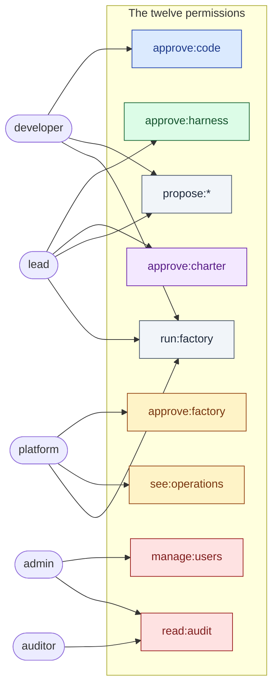
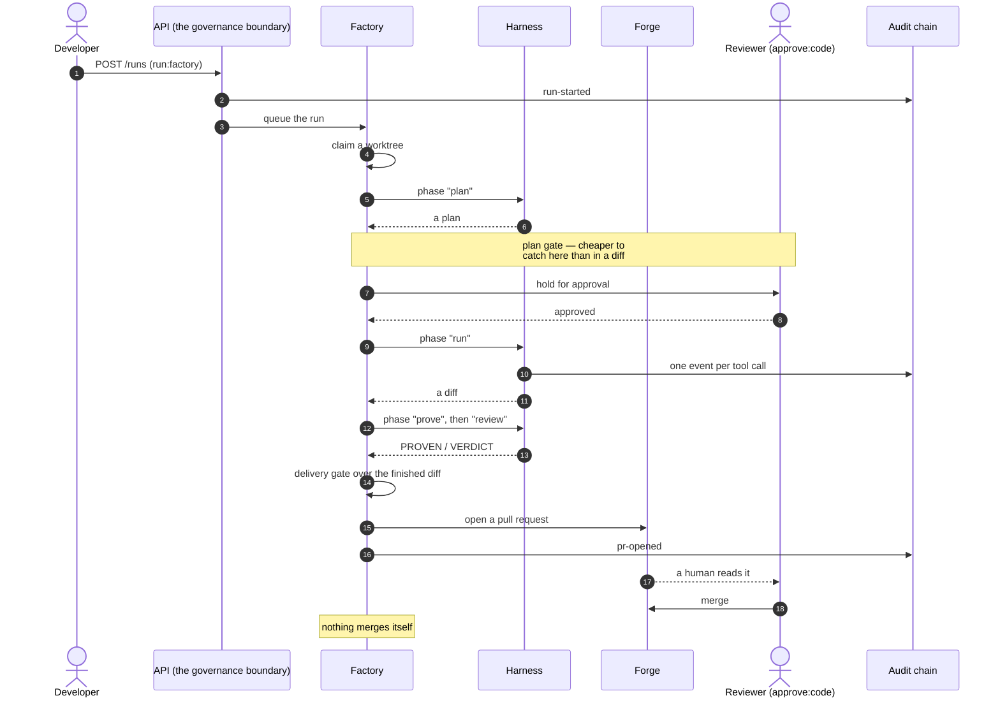
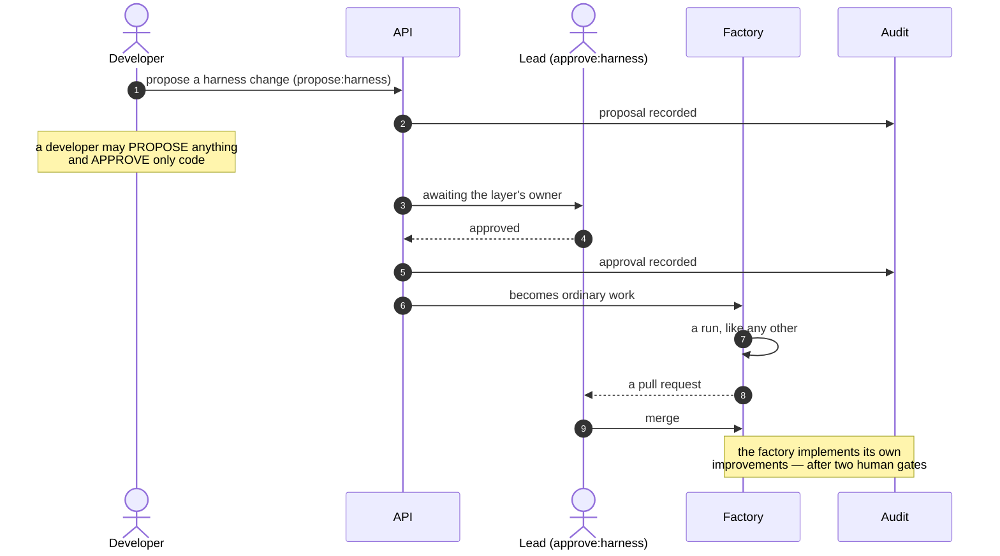
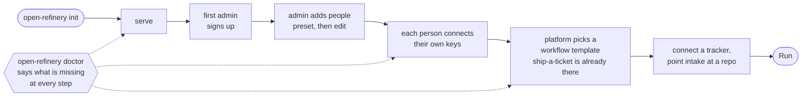
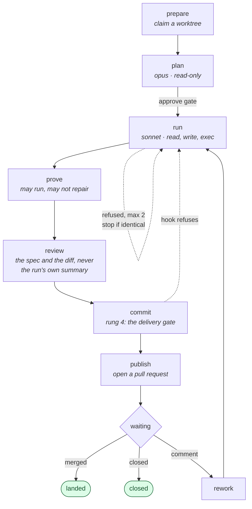
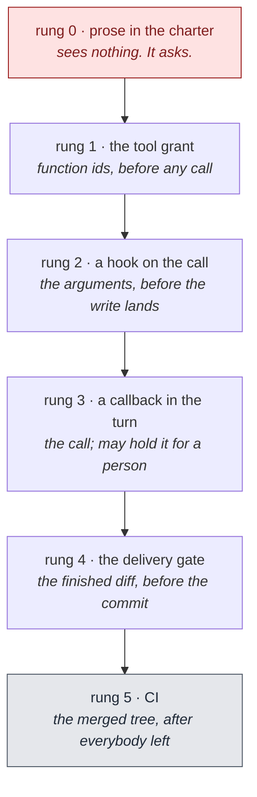

# open-refinery — the feature list

*What exists, and who can reach it. Companion to
[GLOSSARY.md](GLOSSARY.md), which says what the words mean, and to
[LIMITATIONS.md](LIMITATIONS.md), which says what the product does not do.*

Two things to hold on to before the list:

- **Authorization is a set of permissions on a person.** Roles are *presets* —
  starting points copied onto a user at creation, never read again. Where a
  preset name appears below it is shorthand for "whoever holds that set".
- **A layer is what a change is *about***: `code` · `harness` · `factory` ·
  `charter`. Almost every gate in the system keys off one.

---

## 0. Every feature

Four things the product does, and everything it ships to do them. 137
operations across 112 paths; the tables in §2 map each to the permission it
needs.

### 0.1 Ship a change

| Feature | What it does |
|---|---|
| **Intake** | A ticket arrives three ways and behaves the same however it did: a tracker **webhook** (HMAC-signed; the signature *is* the credential, and an integration with no secret accepts nothing), a **sync** that pulls a tracker's issues, or **by hand**. `autostart` decides whether it runs by itself. |
| **Work items** | The ticket. No state machine of its own — its stage is derived from its runs. |
| **Pipelines** | The stage graph, versioned; a run pins the version it started under, so an edit cannot reach work in flight. Four templates: `ship-a-ticket` · `quick-fix` · `docs-only` · `strict`. Validate before saving; export as a document; edit on a canvas. |
| **Runs** | One run, one worktree, one branch, one pull request. Start, watch, preview what the machine would do next, advance one stage, clear a hold. |
| **Workers** | N workers claim a run with a conditional update, advance it one stage, release it. A stale claim is taken over; a crash resumes, because the `Run` row *is* the state. Team concurrency caps bound how many are in flight. |
| **The harness** | Seven phases — `refine` · `plan` · `run` · `prove` · `review` · `security` · `improve` — each with its own prompt, model, turn cap and **tool grant**. Deciding and building are separate turns on different models. |
| **Contracts** | `PROVEN:` / `VERDICT:` parsing over a phase's answer. **Unparseable is never a pass.** |
| **Worktrees** | A git worktree per run, rooted so a turn cannot write outside it. Refuses a repository that is not a local checkout before creating anything. |
| **Forges** | GitHub · GitLab · Gitea · Bitbucket · `local`. Opens the pull request, watches it, and turns a reviewer's comment into rework. **Nothing merges itself.** |
| **Delivery gate** | Rung 4: a predicate over the finished diff, before the commit. |
| **Oversight** | A per-repository dial — `manual` → `dark` — that becomes the set of tool calls a turn interrupts on. |

### 0.2 Govern it

| Feature | What it does |
|---|---|
| **Permissions** | Twelve, on the person: `approve:<layer>` · `propose:<layer>` over four layers, plus `run:factory`, `manage:users`, `read:audit`, `see:operations`. `propose:*` is wide; `approve:*` is narrow. |
| **Presets** | Named permission bundles to start a person from — copied once, never read again. Editable; `builtin` ones cannot be deleted. |
| **The ladder** | Six rungs and what each can *see*. The product carries 0, 1, 3 and 4; rung 2 is the target repo's commit hook and rung 5 is its CI. Four predicates ship. **Promotion and demotion are not symmetric** — a demotion needs a second signer and the factory never performs one. |
| **Policies** | Allow/deny artifacts keyed to a **permission**, with `strict` locking, per-namespace scope, an org `audit`/`strict` enforcement mode, full version history and point-in-time reconstruction. |
| **Packs & standards** | Thirty-one bundles of written guidance and governed artifacts, enabled as a unit. Enabling one is a charter change. |
| **Proposals** | Anyone may put a change forward; only the layer's owner signs it, through an ordered chain with a distinct signer per slot. |
| **Content filter** | Secrets refused at every tool call; personal data redacted where text **leaves** — the pull-request body — with a Luhn check so a constant is not a card number. |
| **Budgets** | A shared ceiling over a rolling window at `org`/`team`/`repo` scope, plus `max_run_units` per repository for a single run. Metered off what the provider reported. |
| **Pre-action gate** | `POST /authorize` lets an out-of-process harness check identity and declared intent against policy *before* it acts. |
| **Teams** | Grouping, plus the concurrency cap and team-scoped budgets. |

### 0.3 Prove it

| Feature | What it does |
|---|---|
| **Audit chain** | Append-only, hash-chained and **keyed** — each link an HMAC under a subkey of `SECRET_KEY`, so forging an event and recomputing the chain does not work without the key. Verify and export (JSON/CSV) with `read:audit`; **retention (purge) is `manage:users`**, and leaves a signed **checkpoint** explaining the gap. |
| **Auditor grants** | A time-boxed, read-only token for an external auditor with no account: it reads the trail and the evidence packs and mutates nothing. Minting and revoking one is `manage:users` — handing out access is the admin act, and a grant that could mint another would never expire. |
| **Evidence packs** | The trail mapped onto `soc2` · `iso27001` · `hipaa` · `gdpr`, control by control. |
| **Metrics** | Delivery — runs, landed/closed/failed, `landed_pct` over *finished* runs, time to a pull request and to an outcome — plus per-stage health, worst first, and work by stage. |
| **Spend** | What each run cost, and what is used against every ceiling. |
| **Improve lane** | One read over the record for what went wrong. **Evidence or it is dropped**, and nothing is applied — a finding becomes a proposal. |
| **Webhooks & notifications** | HMAC-signed event delivery to an endpoint; Slack / webhook / email alerts on a matching recipe. |
| **Live channel** | A WebSocket that publishes every stage change, plus per-run log tailing. |

### 0.4 Run the place

| Feature | What it does |
|---|---|
| **Setup** | `open-refinery init` writes the env and the database; the first sign-up becomes the owner and seeds `ship-a-ticket`; a six-step wizard ends by **starting a run**. |
| **`doctor`** | Nine checks, each carrying a remedy rather than only a diagnosis — including whether a repository is actually a local checkout, which is the first thing a real run fails on. |
| **`config`** | Every effective setting and where it came from. |
| **Migrations** | Versioned, automatic on `serve`, explicit via `open-refinery migrate --to N` in either direction. Every entry has a reverse. |
| **Credentials** | One person's key per service, encrypted at rest, verifiable, rotatable. A secret is never returned to anyone at any permission. |
| **Agents** | An external harness registers by OAuth **device flow** — it shows a code, a person approves it — and gets a token it can rotate. It cannot be granted authority its registrar does not hold. |
| **MFA** | TOTP enrolment, confirmation and disable for local accounts. |
| **Settings** | Config lives in the database, encrypted and UI-managed, so **only `SECRET_KEY` is required in the environment**. |
| **Jobs & scheduler** | Long work off the request path, and scheduled repository re-reads. |
| **API docs** | Self-hosted Swagger UI at `/api-docs`, assets bundled at build. |
| **Dashboard** | Nine screens; a developer sees seven. |

---

## 1. Who can do what



**Read the gaps, not the arrows.** Three of them carry the whole design:

| Gap | Why |
|---|---|
| **admin approves nothing** | The account that grants access is not the account that approves what ships. A compromised admin can create users and read the log; it cannot merge a change or weaken a rule. |
| **lead ≠ platform** | The product is both a harness and a factory, so each gets an owner. A lead changing a prompt does not need platform; platform changing a route does not need a lead. |
| **nobody above developer approves code** | A lead reviewing a teammate's pull request holds no special authority over it. That review is a developer's job. |

`propose:*` is deliberately wide and `approve:*` is deliberately narrow. That
asymmetry is what the improve lane runs on: anyone may put a change forward,
and only the layer's owner signs it.

---

## 2. Every feature, by the permission it needs

137 routes. Grouped by what you must hold to reach them.

`propose:*` below is shorthand for all four: `propose:code`,
`propose:harness`, `propose:factory`, `propose:charter`.

### Open to any signed-in person

| Feature | Routes |
|---|---|
| Who am I, what do I hold | `GET /me` · `GET /users/{id}/permissions` (your own) |
| Read the vocabulary | `GET /permissions` · `GET /permissions/approvers/{layer}` · `GET /roles` |
| Read the rules, and where each is carried | `GET /ladder` · `GET /ladder/{id}/move` |
| Read the shared workflow | `GET /pipelines` |
| Your own connections | `GET|POST|PUT|DELETE /credentials` · `GET /credentials/catalog` |
| Your own repos and work | `GET /repositories` · `GET /work-items` · `GET /metrics` |
| What your runs cost | `GET /usage` · `GET /budgets` |
| What is waiting on you | `GET /approvals` · `POST /runs/{id}/approve` |
| Put a change forward | `POST /proposals` · `GET /proposals` · `POST /proposals/{proposal_id}/review` |

A credential is personal: you see and manage your own, and a secret is never
returned to anyone at any permission.

### `run:factory` — doing the work

| Feature | Routes |
|---|---|
| Create work | `POST /work-items` |
| Pull tickets in from a tracker | `POST /integrations/{id}/sync` |
| Let a tracker push them in | `PUT /integrations/{id}/intake` (sets the webhook + autostart) |
| Trigger a run | `POST /runs` |
| Watch runs move | `GET /runs` · the live canvas over `/ws` |
| Clear a hold | `POST /runs/{id}/approve` |

### `approve:factory` — the factory is platform's

| Feature | Routes |
|---|---|
| The stage graph | `POST /pipelines` |
| Ceilings on what runs may spend | `POST|DELETE /budgets` |

### `approve:<layer>` — a rule is the layer owner's

| Feature | Routes |
|---|---|
| Put a rule on the ladder | `POST /ladder` |
| Move it to another rung | `POST /ladder/{id}/move` — a demotion needs a second signer |
| Turn one off | `DELETE /ladder/{id}` — refused above rung 0 |

### `approve:charter` — the standards are the lead's

| Feature | Routes |
|---|---|
| Org rules | `POST|DELETE /policies` |
| Standards packs | `POST /packs/{key}/enable` · `POST /packs/{key}/disable` |

### `see:operations` — other people's work, and the machinery

| Feature | Routes |
|---|---|
| Everyone's repos, work and runs | the same GETs, unscoped |
| Config | `GET|PUT|DELETE /settings` |
| Delivery plumbing | `/webhooks` · `/notification-rules` · `/teams` |
| Finish setup | `POST /onboarding/complete` |

### `manage:users` — admin

| Feature | Routes |
|---|---|
| Add people, set permissions | `POST /users` · `PUT /users/{id}/permissions` |
| Define presets | `PUT|DELETE /presets/{name}` |
| Who approves governance changes | `POST /approval-workflows` |
| Lend read-only access out | `POST|DELETE /auditor-grants` |
| Retention | `POST /audit/purge` |

### `read:audit` — admin and the time-boxed auditor grant

**Reading the record and administering it are different permissions.** Every
route here is a GET: retention and minting a grant are `manage:users` above,
because a read-only auditor that could purge the trail or issue itself a fresh
credential is not read-only.

| Feature | Routes |
|---|---|
| The trail | `GET /events` |
| Prove it was not altered | `GET /audit/verify` · `GET /audit/export` · `/audit/export.csv` |
| Compliance packs | `GET /evidence` · `GET /evidence/frameworks` |
| The improve lane | `GET /improve` · `GET /improve/proposals` |
| Who is holding a grant | `GET /auditor-grants` |

---

## 3. The journey of a change

### 3.1 A code change — the common case



The reviewer needs **`approve:code`** — not lead, not platform. And the run
uses **the runner's own credentials**, so the pull request is authored by the
person accountable for it.

### 3.2 A harness change — and why it is different



A `factory` change is the same picture with **platform** in the lead's place. A
`charter` change is the same with **lead** again, because the standards are
what the harness reads.

### 3.3 A ladder move — promotion and demotion are not symmetric


Two rules do the work. **Evidence or it is dropped** — a lane that always finds
three things is one nobody believes by the third time. And **a demotion is the
one move that makes the system weaker**, so it never runs unattended and the
factory never carries it out itself.

---

## 4. Workflows

### 4.1 Getting started — install to first run



`doctor` is the thread through all of it: nine checks, each carrying a remedy
rather than only a diagnosis. Signing up seeds `ship-a-ticket`, so there is a
workflow to run before anybody has drawn one.

Work reaches the factory three ways, and behaves the same however it arrived:


The webhook is the one route with no bearer token — the caller is a tracker,
not a person — so the signature is the credential, and an integration with no
secret accepts nothing.

### 4.2 The default pipeline — `ship-a-ticket`



Three things in that picture are the whole design: **deciding and building are
separate turns on different models**, **a check may run and may not repair**,
and **nothing merges itself**.

### 4.3 Oversight is a dial

```mermaid
flowchart LR
  M[manual<br/>a person answers<br/>every call] --> A[attended<br/>every write] --> S[supervised<br/>what a rule marks ask] --> AU[autonomous] --> D[dark<br/>nothing waits]

  R[["`ask` NEVER becomes `allow`.<br/>At autonomous and dark it degrades to REFUSE —<br/>an unattended factory reading ask as yes has<br/>answered a question nobody put."]]:::rule
  AU -.-> R
  D -.-> R

  classDef rule fill:#fef3c7,stroke:#92400e,color:#78350f
```

### 4.4 Where a rule is carried — the ladder



**A rung is a place, not a strictness.** Rung 3 sees a call and never a diff;
rung 4 sees a diff and never the call. A rule that matters names both. And
climbing costs something — pick the cheapest rung that can actually see the
thing the rule is about.

---

## 5. The four pillars, and what exists today

| Pillar | State |
|---|---|
| **1 · A software factory** | **Working end to end.** A ticket arrives by webhook, sync or hand; a run goes through the stage graph; the delivery gate opens a pull request; a comment on it becomes rework. Exercised by `tests/test_acceptance.py` against a real git repository with the `local` forge — no accounts, no network, no keys. |
| **2 · A harness** | **Working.** deepagents behind `pipeline/agent.py`, seven phases, tool grants as rung 1, `Governed` as rung 3, oversight → interrupt → hold. |
| **3 · A queue of workers** | **Working.** N workers claim a run with a conditional update, advance it one stage, release it; stale claims are taken over; team caps bound concurrency; a crash resumes. |
| **4 · Business features** | **Working.** Keyed audit chain, evidence packs, the improve lane, proposals, budgets, delivery metrics, the live canvas. |

**What 3.0 changed is mostly what it removed.** 2.25.0 shipped a complete
feature set carrying two of several things — two governed call sites, two
workflow engines, two authorization models — and in each pair the older half was
what the docs, the dashboard and `doctor` pointed at. See
[ROAD-TO-3.0.md](ROAD-TO-3.0.md) for the nine steps and
[GLOSSARY.md](GLOSSARY.md#words-we-do-not-use-any-more) for the words that went
with them.
